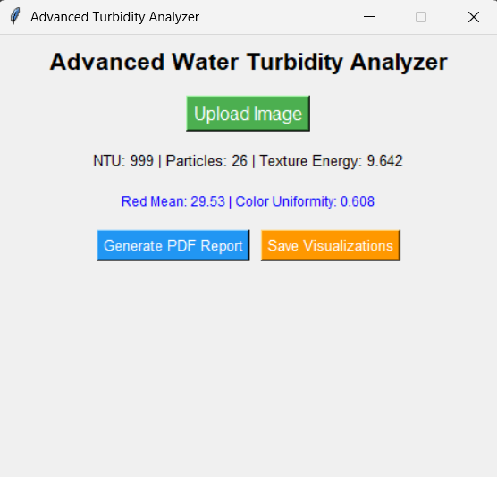
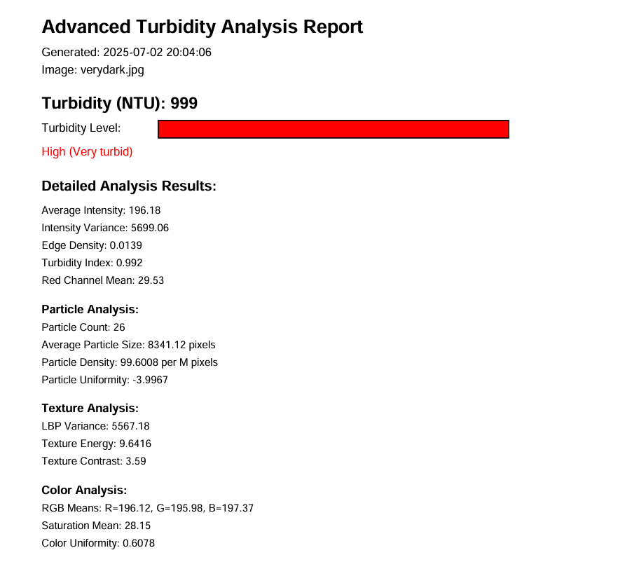
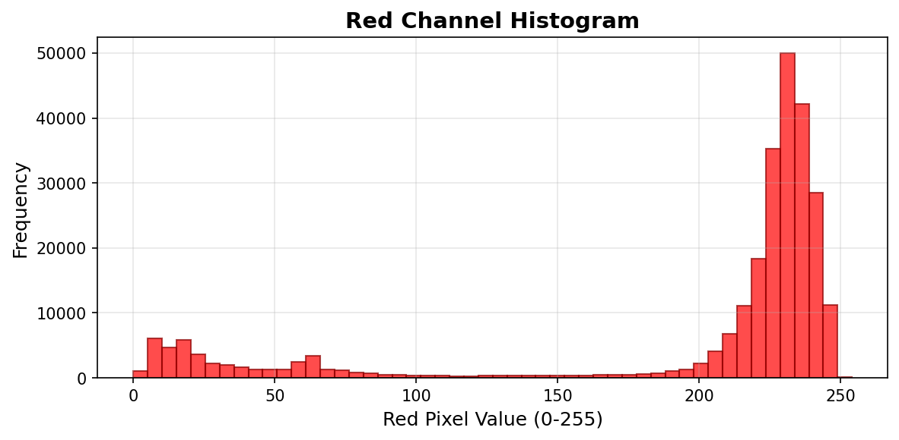
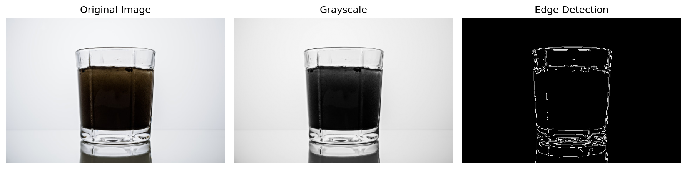

# 💧 Image-Based Water Turbidity Analysis System

This project is a **Python GUI application** for analyzing water turbidity from images using **OpenCV** and **Tkinter**.  
It calculates key turbidity metrics such as **NTU**, **red channel histogram**, **edge density**, and more.

A professional **PDF report** is generated after analysis, complete with a color-coded turbidity bar and visual histogram.

---
## 📸 Sample GUI
Window 
   
---

##  📊 Sample Output

| Image | Red Channel Histogram | Edge analysis|
|-------|------------------------|
|  |  |  |

---

## 🧠 Features

- Upload image of water sample
- Analyze turbidity using red channel model and image features
- Calculate:
  - Average intensity
  - Intensity variance
  - Turbidity index
  - Edge density
  - Red channel histogram
  - Final NTU value
- Display histogram in a popup window
- Generate **PDF report** with visuals and color-coded NTU bar

---

## 🔧 How to Run

### 1. Install Python dependencies

```bash
pip install opencv-python numpy matplotlib reportlab
