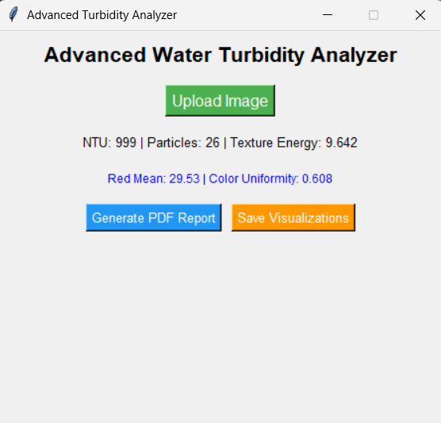
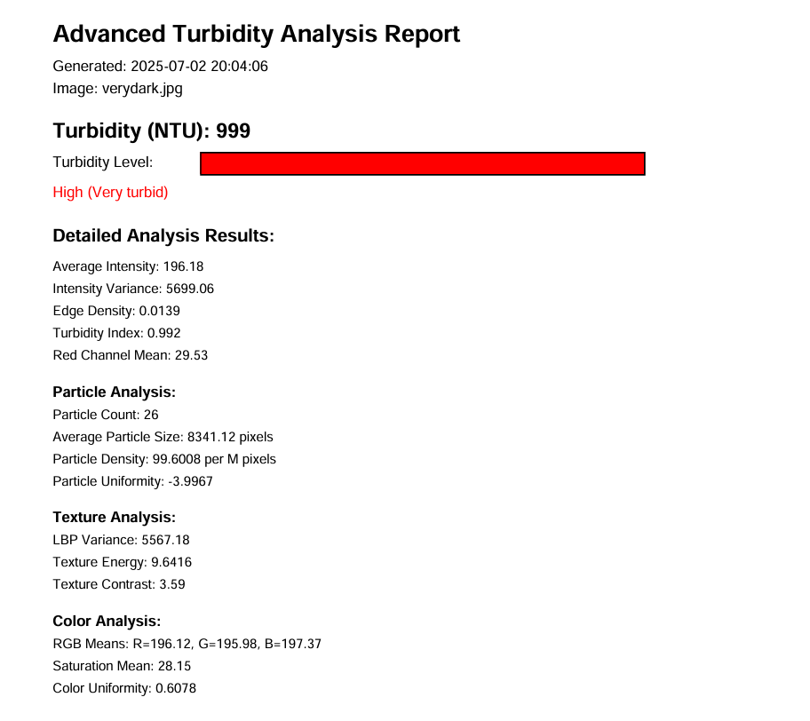
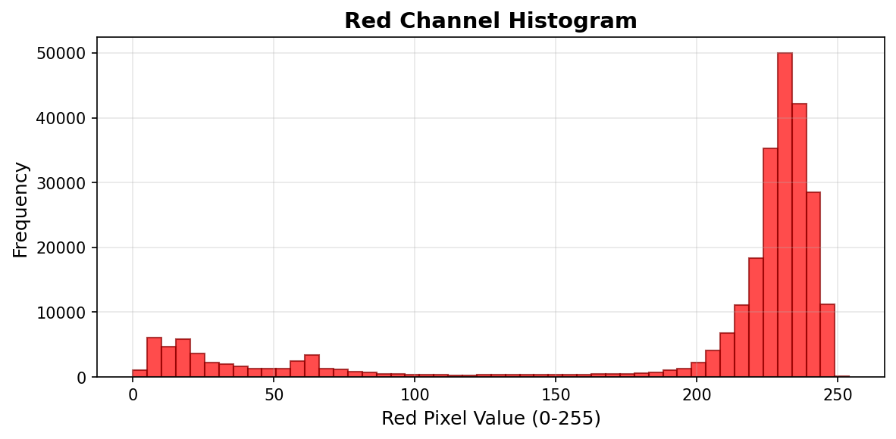
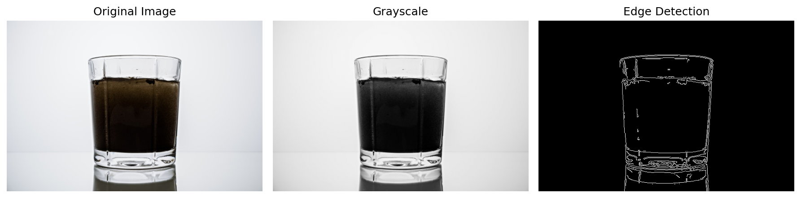

# 💧 Image-Based Water Turbidity Analysis System


## 📖 About
A Python-based computer vision system that estimates water turbidity (NTU) from digital images. It combines red channel modeling, edge detection, and particle analysis to provide a cost-effective alternative to hardware turbidimeters, complete with a Tkinter GUI and automated PDF reporting.

**Tags:** `#Python` `#OpenCV` `#ComputerVision` `#WaterQuality` `#Turbidity` `#GUI` `#DataAnalysis` `#EnvironmentalTech`

---

## 📸 Sample GUI & Output
### User Interface


### Analysis Results
| Feature | Visualization |
| :--- | :--- |
| **Original Sample** |  |
| **Red Channel Histogram** |  |
| **Edge Analysis** |  |

---

## 🧠 Core Features
- **Intuitive GUI:** Built with Tkinter for easy image uploading and real-time feedback.
- **Automated Preprocessing:** Includes watermark removal, noise reduction (Median Filter), and smoothing (Gaussian Blur).
- **Advanced Metrics:**
  - Average Intensity & Variance
  - Turbidity Index
  - Edge Density (Canny)
  - Particle Count & Density
  - Particle Uniformity
- **Visual Analytics:** Generates red channel histograms and edge maps.
- **Professional Reporting:** Automatically exports results into a detailed **PDF report** with color-coded NTU severity bars.

---

## 🔧 Installation & Setup

### 1. Prerequisites
Ensure you have Python 3.8+ installed.

### 2. Install Dependencies
```bash
pip install opencv-python numpy matplotlib reportlab scikit-image scipy
```

### 3. Run the Application
```bash
python turbidity_gui.py
```

---

## 🛠️ Technologies Used
- **OpenCV:** Core image processing and feature extraction.
- **Tkinter:** Graphical User Interface.
- **Matplotlib:** Data visualization and histogram plotting.
- **ReportLab:** PDF report generation.
- **NumPy/SciPy/Scikit-Image:** Numerical computing and advanced image analysis.
